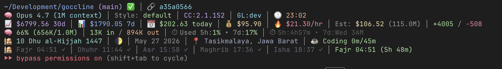

<div align="center">


# goccline

**The Claude Code statusline that thinks about your salat.**

Prayer times. Hijri calendar. GPS auto-detect. Plus all the cost / token /
context / git widgets you'd expect — in a single 9 MB Go binary that
renders in ~400 ms.

[](https://github.com/andhikapraa/goccline/releases)
[](https://pkg.go.dev/github.com/andhikapraa/goccline)
[](https://opensource.org/licenses/MIT)

</div>



```
~/Development/goccline (main) ✅ │ 🔗 a35a0566
🧠 Opus 4.7 (1M context) │ Style: default │ CC:2.1.152 │ GL:v1.1.0 │ 🕐 19:47
📈 $6780 30d │ 📊 $1764 7d │ 📅 $174 today │ 💰 $83.39 │ 🔥 $55.82/hr │ Est: $279 (510M) │ +3436 / -427
🧠 61% (606K/1.0M) │ 1K in / 816K out │ ⏱ Used 5h:19% • 7d:15% │ ⏱ 5h:3h12m • 7d:Wed 3AM
🕌 10 Dhu al-Hijjah 1447 │ 🌓 │ May 27 2026 │ 📍 Tasikmalaya, Jawa Barat │ ☕ Coding 0m/45m
🕌 Fajr 04:51 ✓ │ Dhuhr 11:44 ✓ │ Asr 15:58 ✓ │ Maghrib 17:36 ✓ │ Isha 18:37 ✓ │ Fajr 04:50 (9h 50m)
```

## Install

```bash
curl -fsSL https://raw.githubusercontent.com/andhikapraa/goccline/main/install.sh | sh
```

That's it. The script picks the right binary for your platform, drops a
default config in `~/.claude/goccline/Config.toml`, and wires it into
`~/.claude/settings.json` (after backing up your existing one).

Reload Claude Code and the statusline appears. **Total time to first
render: ~30 seconds.**

> Prefer to read before piping to sh? [Read the script.](./install.sh)
> Or `go install github.com/andhikapraa/goccline@latest`.

## Why this exists

I was on the popular bash statusline. Then it stopped rendering when I
turned on cost tracking — turns out it scans every JSONL file in
`~/.claude/projects/` per cost component per render. My ~21,000 session
files made that ~15 s, well past Claude Code's statusline budget. After
trying to patch it, I gave up and rewrote it in Go in one evening.

This is the result. It does what the bash one does, plus the things only
goccline does:

- **Prayer times** with countdown to the next prayer, auto-rolling to
  tomorrow's Fajr after Isha.
- **Hijri calendar** with the current lunar phase emoji.
- **GPS-driven location** via CoreLocationCLI on macOS, reverse-geocoded
  through Nominatim — your statusline knows when you're travelling.
- **Wellness timer** that nudges you after 45 min in a coding burst.

## How it stacks up

| | goccline | ccstatusline | cship | claude-hud | ccusage |
|---|:---:|:---:|:---:|:---:|:---:|
| Language | Go | TypeScript | Rust | JavaScript | TypeScript |
| Single static binary | ✅ | (npx) | ✅ | (npx) | (npx) |
| Components | 30+ | ~20 | ~15 | ~12 | ~6 |
| Cost tracking | ✅ | ✅ | partial | partial | ✅ |
| Native rate-limit fields | ✅ | ✅ | ✅ | ✅ | ✅ |
| Prayer / Hijri / Wellness | ✅ | — | — | — | — |
| GPS auto-location | ✅ | — | — | — | — |
| Bash-statusline-compat TOML | ✅ | — | — | — | — |

## Configure

`~/.claude/goccline/Config.toml`:

```toml
[theme]
name = "catppuccin"  # catppuccin | garden | ocean | classic

[prayer]
location_mode = "gps"            # or "manual"
latitude = -6.2088               # used when mode = "manual"
longitude = 106.8456
method = 2                       # AlAdhan calc (2 = ISNA)
school = 1                       # 1 = Hanafi, 0 = Shafi/Maliki/Hanbali

[display]
lines = 5

[display.line1]
components = ["repo_info", "session_info"]
[display.line2]
components = ["model_info", "session_mode", "version_info", "time_display"]
[display.line3]
components = ["cost_today", "cost_live", "burn_rate", "code_productivity"]
[display.line4]
components = ["context_window", "total_tokens", "usage_limits", "reset_timer"]
[display.line5]
components = ["hijri_calendar", "wellness", "prayer_icon", "prayer_times_only"]
```

All 30+ components are listed below. Mix and match into as many lines as
you want.

<details>
<summary><b>Component reference</b></summary>

| Group | Components |
|---|---|
| Identity | `repo_info`, `session_info`, `model_info`, `session_mode`, `agent_display`, `version_info`, `version_display` |
| Git | `commits`, `submodules` |
| Time | `time_display` |
| Cost | `cost_live`, `cost_today` / `cost_daily`, `cost_weekly`, `cost_monthly`, `cost_repo`, `burn_rate`, `block_projection`, `code_productivity` |
| Tokens | `context_window`, `context_alert`, `total_tokens`, `token_usage` |
| Limits | `usage_limits`, `reset_timer` |
| Islamic | `prayer_icon`, `prayer_times`, `prayer_times_only`, `hijri_calendar`, `location_display` |
| Wellness | `wellness` |

</details>

## GPS prayer times (macOS only, optional)

```bash
brew install corelocationcli
# Then enable Location Services for CoreLocationCLI in System Settings.
```

Set `prayer.location_mode = "gps"` in your config. Goccline caches the
coords for 1 h and the place name for 24 h.

## Performance

| | goccline | Bash statusline (rz1989s) |
|---|---:|---:|
| Full 6-line render | ~400 ms | 4-5 s (timeout with cost) |
| Cold start | ~80 ms | ~2 s |
| Binary size | 9.4 MB | 38 MB + 92 .sh files |
| Lines of code | ~2.5 KLOC Go | ~27 KLOC Bash |

The speed wins come from:

1. **Parallel JSONL parsing** — goroutine pool, mtime-filtered file list.
2. **Native fields first** — read `rate_limits` and `context_window`
   straight from Claude Code's JSON; fall back to transcript only when
   needed.
3. **Per-render memo cache** — multiple cost components share one scan.
4. **24 h disk cache** for prayer-time API responses; 1 h for GPS.
5. **No module-loading ceremony** — one binary, one exec.

## Migrating from the bash claude-code-statusline

The TOML format is intentionally compatible. Your existing
`~/.claude/statusline/Config.toml` should mostly work — copy it to
`~/.claude/goccline/Config.toml` and tweak component names if needed.
Aliases:

- `cost_daily` → handled as alias for `cost_today`
- `token_usage` → alias for `total_tokens`
- `agent_display` → alias for `session_mode`

## Acknowledgements

- Pricing table and dedup pattern ported from
  [backstabslash/goccc](https://github.com/backstabslash/goccc).
- Component layout, Islamic features, and TOML conventions inspired by
  [rz1989s/claude-code-statusline](https://github.com/rz1989s/claude-code-statusline).
- Prayer times via [AlAdhan](https://aladhan.com/prayer-times-api).
- Reverse geocoding via [Nominatim](https://nominatim.org/).
- Hijri conversion via [hablullah/go-hijri](https://github.com/hablullah/go-hijri).
- macOS GPS via [fulldecent/CoreLocationCLI](https://github.com/fulldecent/CoreLocationCLI).

## License

MIT
